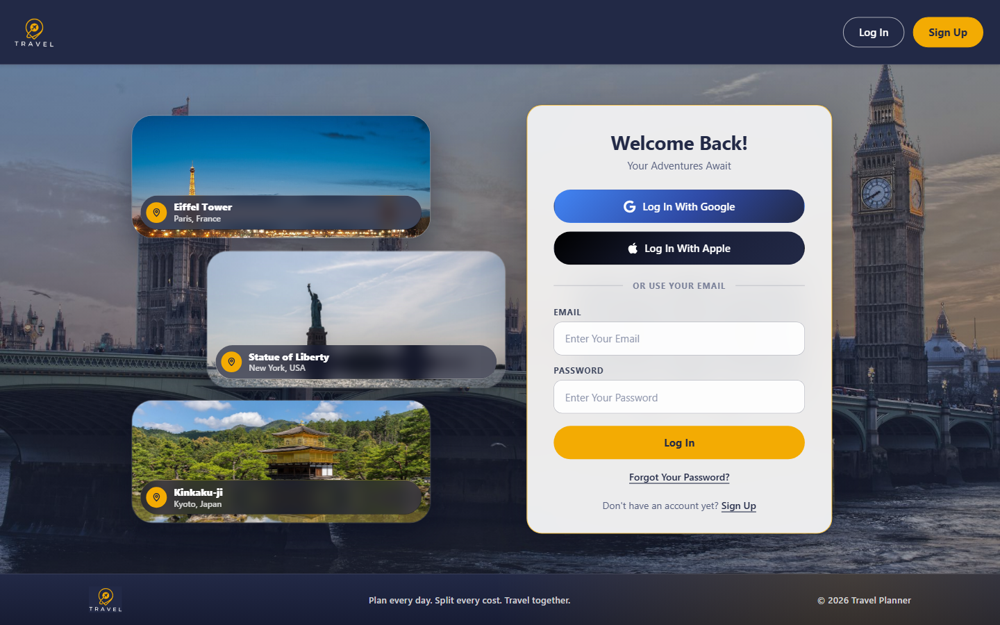
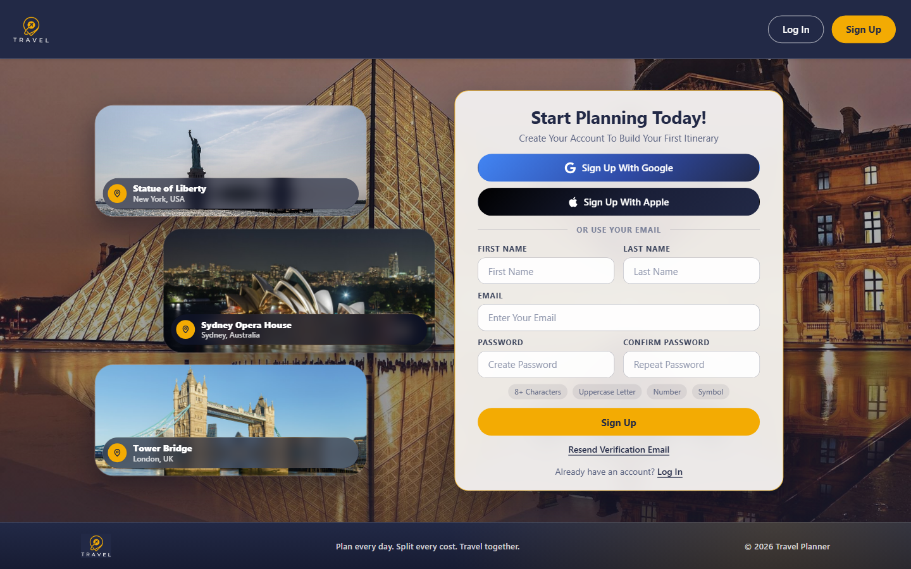

# Travel Planner Web App

**Copyright © 2024–2026 Abel Mesfin. All Rights Reserved.**

---

## Overview

The **Travel Planner Web App** is a full-stack place to plan a trip, share it, and keep the details in one account. You create an itinerary, add bookings, split costs, write notes, and talk with the people on that trip. It is built for solo travelers, group planners, and anyone who wants the days, the map, and the money in the same project.

The interface uses navy (`#222946`) and gold (`#f3ab03`) across the navbar, forms, chat, expenses, and Ask Leo.

---

## Screenshots

Fresh captures of the public pages. Signed-in pages (home, a trip, expenses, friends, and notifications) need an account, so they are described below rather than shown with an older picture.

### Log In

Wide landscape photos of famous places sit beside the form. Portrait shots are skipped so towers are not cropped.

### Sign Up

The same photo cards, with password rules shown as you type: 8 or more characters, an uppercase letter, a number, and a symbol.

---

## Features

### Accounts
- Sign up and log in with email and password, or with Google.
- An Apple button is on the login and signup pages for when Apple sign-in is available.
- New email accounts are asked to verify their address before signing in. A resend button is on the signup page.
- Forgot-password sends a reset email from the login page.
- Passwords need 8 or more characters, an uppercase letter, a number, and a symbol.
- Login and signup sit on a navy page with wide landscape photos of famous places. The cards only use photos that are already wide enough for those rectangles. Labels include Big Ben (London, UK), the Eiffel Tower (Paris, France), Pisa (Pisa, Italy), the Statue of Liberty (New York, USA), Kinkaku-ji (Kyoto, Japan), Tower Bridge (London, UK), and the Sydney Opera House (Sydney, Australia).
- Footer links open the next page at the top.

### Home
- A welcome dashboard after you sign in.
- Shortcuts to create an itinerary, open your upcoming trip, split expenses, and read notifications.
- Recent alerts can jump straight to chat, friends, expenses, or that trip’s Overview. Booking alerts open the trip, not a blank page.

### Itinerary Management
- Create and customize travel itineraries, then open them from the itinerary list.
- Creating a trip from Ask Leo prefills the destination and title.
- Filter upcoming and past trips, edit a trip you host, invite friends, or leave a trip you were invited to.
- Each trip has Overview, Bookings, My Bookings, Expenses, Notes, and Live Chat.
- A dock on the trip page can open **Ask Leo** for that destination.

### Overview
- A day-by-day view of what is booked, with pins for places that have an address.
- A reservation can show a grey **Completed** pill or a green **In Progress** pill beside its category.
- If a stop has no end time, a small check finishes it early. Otherwise it ends when the next booking starts, or when the day ends.
- The same map appears above Bookings and My Bookings and refreshes when a booking is added, changed, or removed.
- Directions between stops cover walking, transit, and driving, with distance and time. Current location stays at the top of the directions panel.
- Maps use Google Maps when it is available, and a backup map when it is not.
- When a day already has a booking, two short buttons sit on the same line as Add To This Day and Ask Leo For Ideas: **Nearby Eats** and **Nearby Activities**.
- Those buttons ask Leo about the latest stop. Leo gets the place, the time, and the open gap before it. A late booking (8:00 PM or later) also asks for late-night spots. The prompt does not cap the answer at a fixed number of places.

### Bookings
- Add flights, hotels, restaurants, activities, and transportation.
- Airport fields search as you type.
- Forms stay short and check that dates fit the trip.
- Upload a confirmation and pull details into the form.
- My Bookings lists what you have already saved, grouped by type.
- Guests can look through a shared trip. Hosts manage edits and who is on the trip.

### Expenses
- Log a cost for a trip, with a title, amount, date, and a category (flight, hotel, restaurant, activity, transport, or other).
- Split evenly across the group, or enter custom shares.
- See each person’s balance so it is clear who owes what, including a partial payment prompt.
- Upload a receipt when you add an expense.
- Open expenses for every trip, or from inside one itinerary.

### Friends
- Add a friend by email and send, accept, or decline requests.
- See friends you already travel with, and shared trips you have finished together.
- Invite a friend onto one of your itineraries from their profile on this page.

### Notifications and Email
- An in-app feed for trips, expenses, bookings, and friends, with filters for each.
- Dismiss and Clear All hide an item from the category tabs as well as the main list.
- Unread chat messages are pulled into the same feed.
- Trip reminders use plain wording: “Your Trip Starts Today”, “Your Trip Starts Tomorrow”, or “Your Trip Starts In N Days”, with the itinerary name in the line under the title.
- On your profile, choose which emails you want:
  - **Bookings & Updates** for changes to flights, stays, reservations, and activities.
  - **Countdowns & Summaries** for upcoming-trip reminders and post-trip wrap-ups.
  - **Expenses & Payments** for shared costs and balances.
  - **Invites & Friends** for trip invitations and friend requests.
  - **Trip Chat** for an email when someone messages a trip you are on.

### Live Chat
- A live chat tab on every itinerary, for everyone on that trip.
- The description in the header stays centered.
- Send messages, reply to a message, and drop a GIF from the picker.
- GIF categories stay on one line and slide sideways, so the names are not cut into a wrapped list.
- Previews animate before you pick one. Search prefers photos of real people and places.
- A lone image or GIF link is sent as a picture.
- **Seen** shows who has viewed your latest message, with small faces, in the style of a read receipt.

### Ask Leo Travel Guide
- A full-screen guide, opened from the navbar as **Ask Leo Travel Guide**.
- Pick a country and city, then ask about that place.
- When a trip is open, Leo can use the saved itinerary for context.
- **Add To Trip** appears only when you already have an itinerary for that city, or when the chat was opened from a trip.
- If you have no trip for that city, the header offers **Create an Itinerary** for that destination instead.
- Nearby Eats and Nearby Activities open this guide with the prompt already written and sent.

### Profile
- Update your first and last name, date of birth, and profile photo.
- Crop an upload or choose one of the built-in avatars.
- The navbar uses that photo, and falls back if a link fails to load.
- Email preferences for the categories above live on this page.

### Footer
- On login and signup, a short footer with the logo and “Plan every day. Split every cost. Travel together.”
- A strip of the navy footer shows above the “Where To Next?” banner.
- When you are signed in, the footer links to Home, Create Itinerary, View Itineraries, Ask Leo, Friends, Expenses, Notifications, and Profile.
- Those links land at the top of the page they open.
- Short tips cover planning together, splitting costs, and asking Leo.
- Ask Leo hides the footer so the guide can use the full screen.

### Itinerary Sharing
- Share itineraries with assigned host and guest roles:
  - **Host**: Full control over itinerary edits, participant management, and deletions.
  - **Guests**: View and interact with shared itineraries without editing rights.
- Guests can leave shared itineraries independently.
- Shared notes stay on the trip, including packing lists, day plans, food lists, and important info. Notes can include emoji.

---

## Technology Stack

### Frontend
- **React.js**: For a dynamic and responsive user interface.
- **Material-UI**: Modern, customizable components.
- **React DatePicker**: Simplifies date and time selection.
- **Google Maps API**: Location search, trip pins, and directions, with a backup map when Maps is unavailable.

### Backend
- **Node.js**: Server-side operations and API management.
- **Express.js**: Simplified API routing and middleware functionality.
- **PostgreSQL**: Database for managing user data, itineraries, bookings, friends, expenses, notifications, and email preferences.
- **Firebase**: Secure authentication, profile data, and real-time updates for chat and notes.
- **Gemini**: Powers Ask Leo, the travel guide.
- **Claude**: Can read an uploaded booking confirmation and fill in the form.

---

## How It Works

1. **Sign Up**: Create an account with email or use Google. Verify your email when you sign up with a password.
2. **Create Itineraries**: Add the trip title, destination, and dates, then open it from Home or the itinerary list.
3. **Build the Trip**: Use Overview to see the days, add bookings, write notes, and check the map and directions.
4. **Collaborate with Friends**: Add friends, invite them onto a trip, and share host or guest access.
5. **Live Chat**: Talk in the trip’s Live Chat tab, send a GIF, and see when your message has been seen.
6. **Ask Leo**: Open the travel guide for ideas about a city, then add a suggestion to a trip that matches that city.
7. **Manage Money**: Log expenses, split them evenly or with custom shares, and turn email alerts on or off from your profile.

---

## Key Use Cases

- **Solo Travelers**: Keep all trip details, bookings, notes, and maps organized in one place.
- **Group Planners**: Collaborate with friends, chat in real time, and manage shared itineraries easily.
- **Frequent Flyers**: Track flights, hotel bookings, transport, and who owes what on each trip.

---

## Project Layout

The React screens stay in the folders the app already imports. Moving those files would break routes and page links, so they were left in place.

| Folder | What lives there |
| --- | --- |
| `src/Pages` | Home, login, and signup |
| `src/features` | Itineraries, expenses, friends, profile, notifications, and Ask Leo |
| `src/Components` | Navbar, footer, auth shell, and the GIF and emoji pickers |
| `src/utils` | Shared helpers, including the landscape photo picker |
| `server/routes` | API routes |
| `server/services` | Mail, the travel guide, and booking or receipt reading |
| `server/database` | SQL helpers and notification text |
| `server/scripts` | Occasional maintenance scripts. They are not part of the running server |
| `docs/screenshots` | Page captures used in this README |

Routes, for reference:

- `/login` and `/signup`
- `/` home
- `/itineraries/create`, `/itineraries-view`, and `/itineraries/:id`
- `/expenses` and `/expenses/:id`
- `/friends`, `/notifications`, `/profile`
- `/travel-guide` and `/travel-guide/:country/:city`

---

## License
Copyright © 2024–2026 Abel Mesfin. All Rights Reserved.

Permission is NOT granted to use, copy, modify, or distribute this software or its documentation without prior written consent from the author. Unauthorized use of this project is strictly prohibited.

By using this repository, you agree to respect the intellectual property rights of the creator.

---

## Support

Have questions or suggestions? Reach out to me:
- **Email**: abelstar10@gmail.com
- **GitHub**: [Abel0217](https://github.com/Abel0217)

---

## Enjoy Your Travel Planning!
